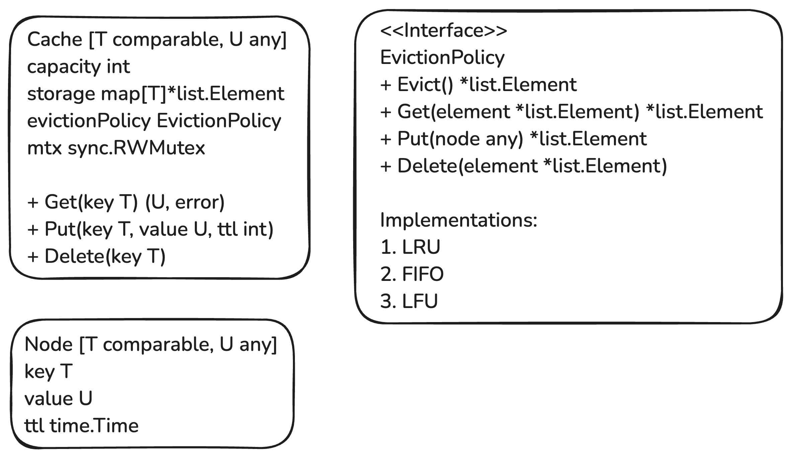

## In-Memory Cache System

Design and implement an **in-memory cache** that supports the following features:

### Requirements:

1. **Basic Operations**:

   - `Set(key, value, ttl)`: Add a key-value pair with a time-to-live (TTL).
   - `Get(key)`: Retrieve the value for a key if it exists and hasn't expired.
   - `Delete(key)`: Remove a key manually.

2. **Eviction Policies**:

   - Support multiple eviction policies:
     - **LRU (Least Recently Used)**
     - **LFU (Least Frequently Used)**
     - **FIFO (First In First Out)**
   - Evict entries when the cache reaches its maximum capacity.

3. **Concurrency**:

   - Ensure thread safety so multiple goroutines can access the cache simultaneously.

4. **TTL Expiry**:
   - Automatically remove keys that have expired based on their TTL.

### Future Improvements

- TTL based keys removal pending (might use heap for removing expired keys)
- Storage map in cache can be moved out as separate interface and the above thing can be placed in there.

### Solution:

